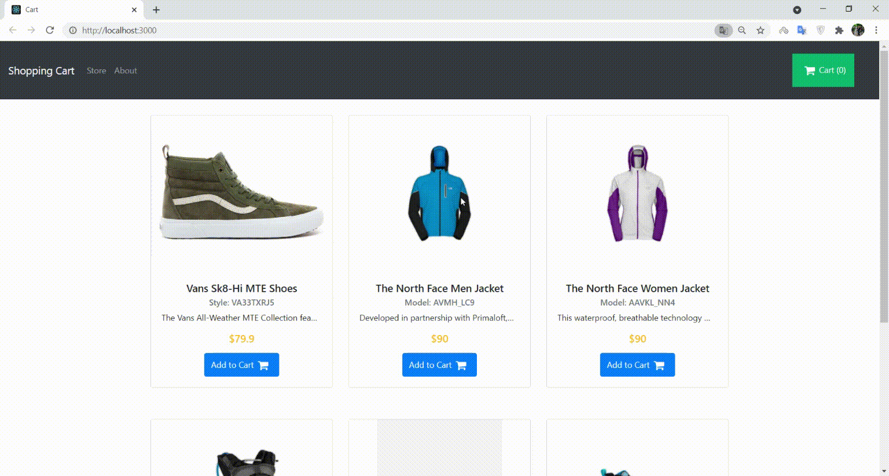
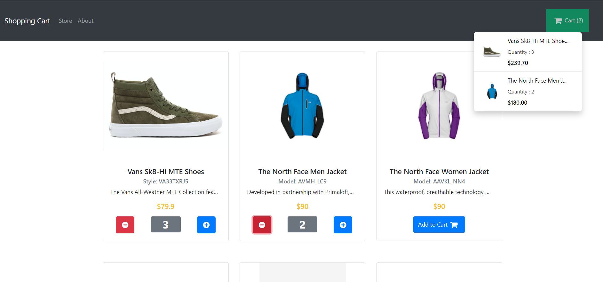

## Shopping Cart

Kodluyoruz Shopping Cart* projesi gerekli gereksinimler yerine getirildi. Gereksinimler dışında projenin büyük kısmında kod iyileştirmesi yaptım, ek olarak dinamik sepet ekledim.

  

### Proje Nasıl Çalıştırılır

- Projeyi fork'ladıktan ya da indirdikten sonra projenin bulunduğu klasörde "npm install" komutu ile gerekli paketlerin yüklenmesi gerekiyor.
- Daha sonra "npm run start" komutu ile uygulama başlatılabilir.

### Screenshot

  

### 

* [Kodluyoruz İlgili Proje Repo*](https://github.com/Kodluyoruz/shopping-cart)
